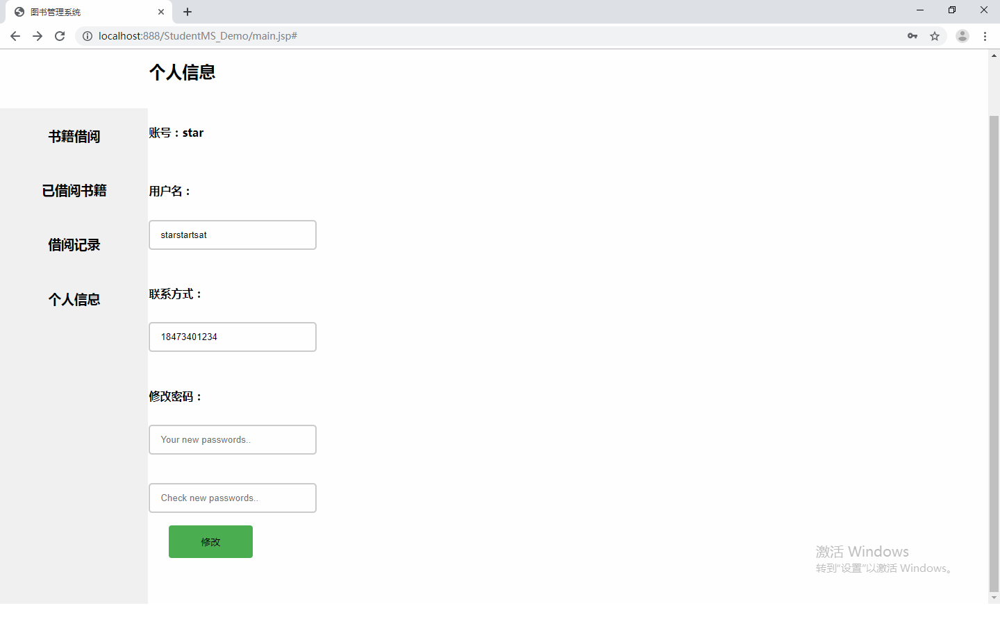

javaweb图书借阅管理系统

框架：jsp+javabean+mysql+tomcat
读者：登陆注册，查询并借阅图书，查询借阅历史，归还图书，个人信息修改
管理员：对图书进行增删改查处理，可以对读者进行删除和修改操作，查询所有借阅记录

管理员运行截图：

读者截图:

运行项目步骤：

1.项目导入本地后可能会出现红色感叹号，右键项目properties选择java build path修改对应红叉的配置

2.将sql文件导入本地数据库

3.将sql_con下的Mysql_con中修改本地数据库连接

4.右键项目运行
